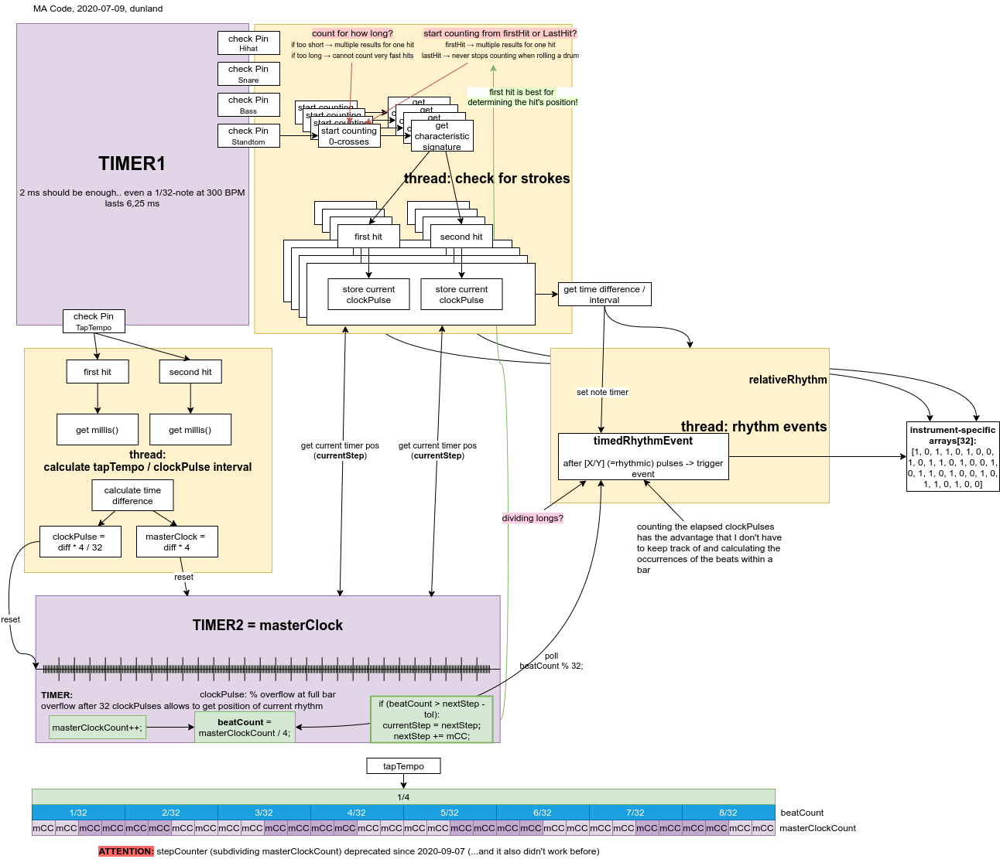
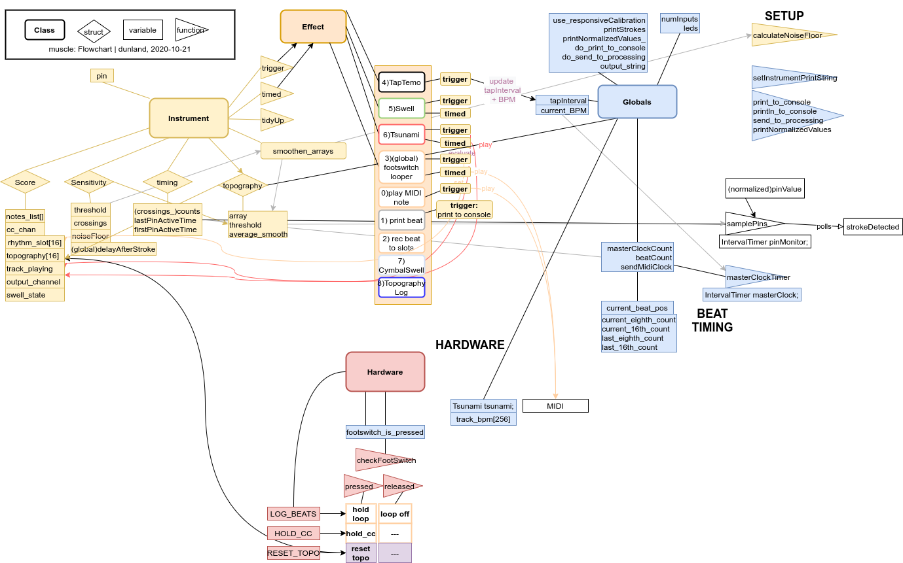

# Code

main Code is in `teensy/`.. use platformio to compile (with atom, vscode, ...)

Sketches for sensor calibration (can be compiled with Arduino IDE and) can be found in the `debug/` folder


## folder structure

```
project
└───debug
│       holds Arduino-style sketches used to evaluate calibration values
│	for contact mics / stroke detection
└───processing
│       processing sketches for visuals and monitoring. they might be really
│	helpful to keep an overview over all of the parameters
└───python
│	contains a python tool I used in the calibration process...
└───teensy
	contains the main code to be uploaded to the teensy microcontroller.
	to be used with platformio (on atom or vscode or ... )
```

  
Code overview


  
Code Flowchart
