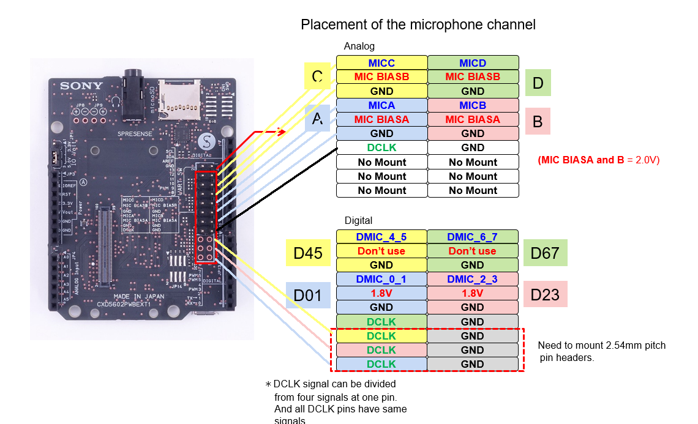

# SONY SPRESENSE log
Hier kommt der Fortschritt mit allen Hindernissen und Lösungen rein bei der Arbeit mit dem SPRESENSE Microcontroller rein.

## examples

###player_wav.ino:

"Sound.wav" auf SD-Karte  
WAVDEC von [github](https://github.com/sonydevworld/spresense-arduino-compatible/tree/master/Arduino15/packages/SPRESENSE/hardware/spresense/1.0.0/libraries/Audio/examples/dsp_installer/wav_dec_installer) geladen und in Ordner "BIN" auf SD-Karte gelegt.

oder: wav_dec_installer.ino ausführen.. :b

### connecting mics:
  

Funktioniert mit Electret Mic: `SPRESENSE_audioPass.ino`  
in 3.3V Mode
Mic A:  
PIN 1: Mic + --> direct  
PIN 2: Mic + --> 2.2kOhm  
PIN 3: Mic -  

### Line In:
3.3V Mode
iPod in
PIN 1: Line + 
PIN 2: ---
PIN 3: GND
