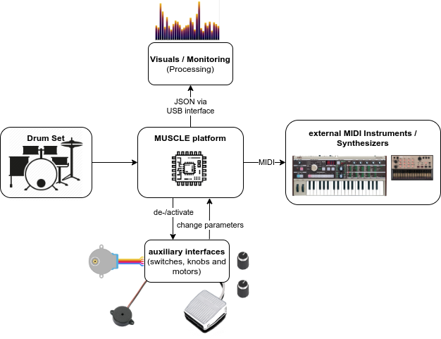
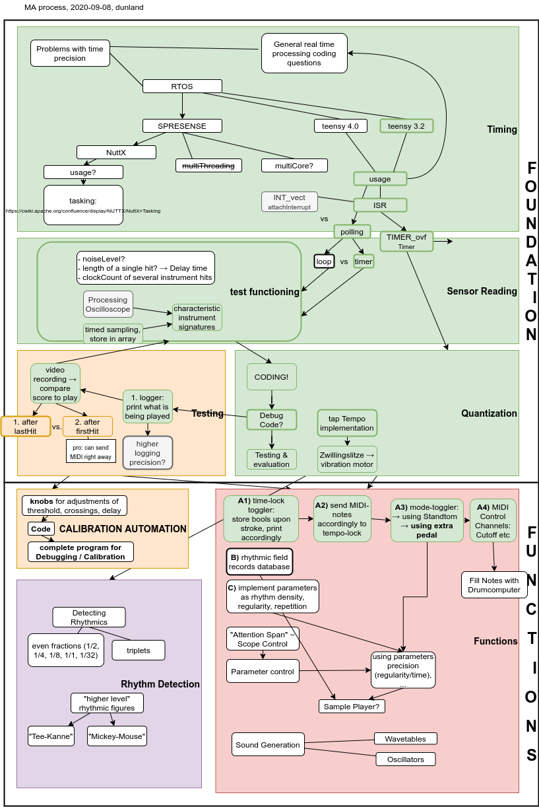

## folder structure

```
project
└───Code
│       code folder. contains subfolders 
│	└───teensy
│	│	holding the main code
│	└───debug
│	│	for Arduino-sketches used to evaluate the contact mic sensitivities
│	└───processing
│	│	with an exemplary sketch for the real-time generation of visuals
│	└───python
│		with a script supporting the calibration process graphically
└───Doc
│       Documentation folder with images and progress logs and other media files
└───hardware
│	CAD and ECAD files
└───literature
│	some interesting material on using piezo microphones, interrupts on teensy, etc
└───logs
│	this folder holds logs that are recorded from contact microphone streams
│	while playing the instruments
└───misc
	miscellaneous.
```

## project management



